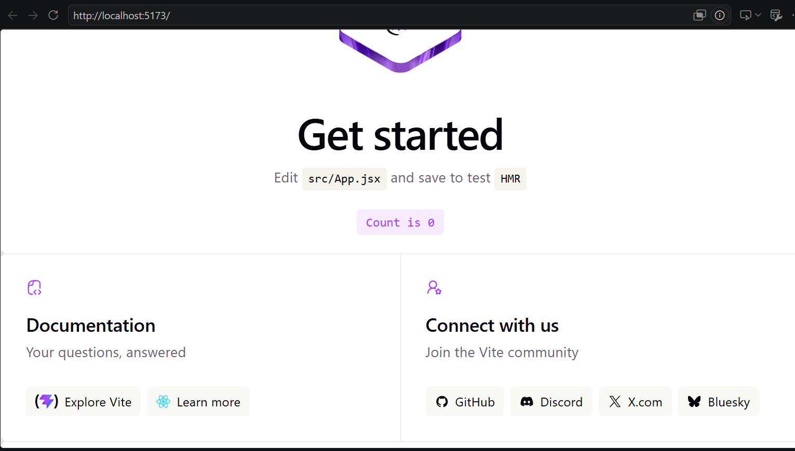
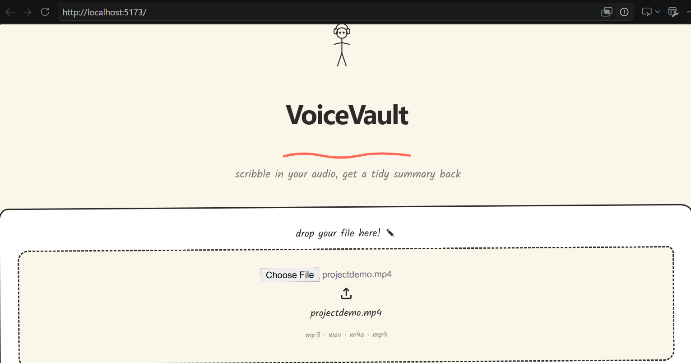
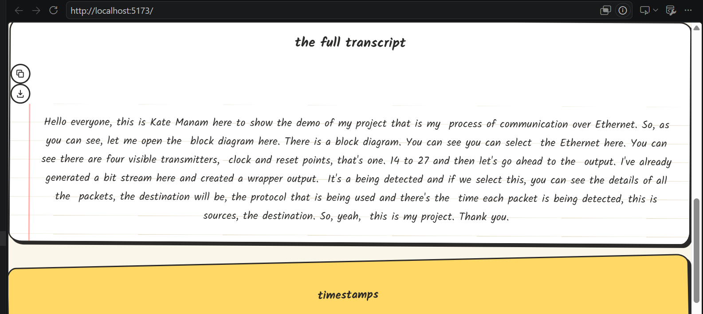
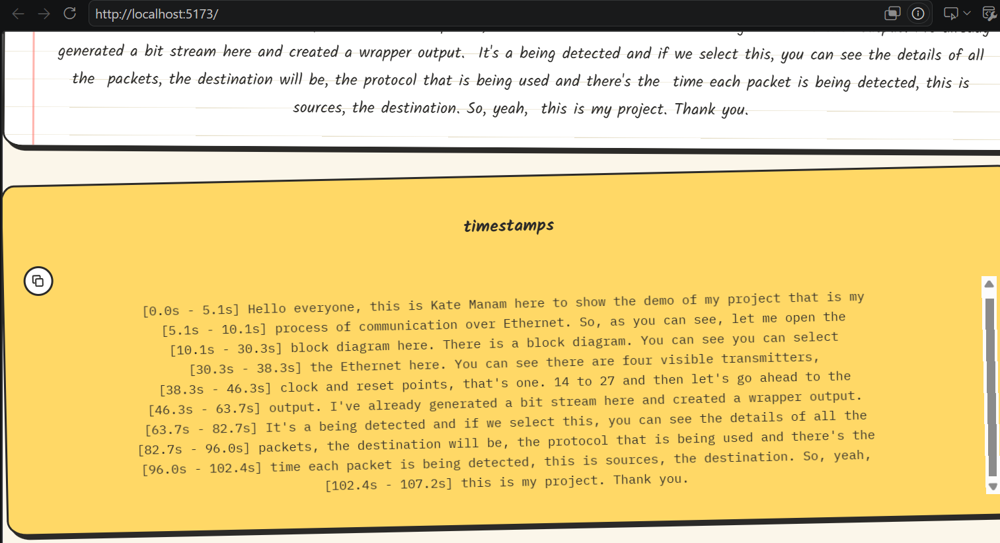

# VoiceVault 🎙️

**Local Audio Transcription & AI Summarization**

*Turn hours of audio into actionable insights — completely offline and private.*



> A beautiful, fast, and fully local AI tool that transcribes audio/video files and generates intelligent summaries using Whisper + Ollama.

---

## ✨ Why VoiceVault?

- 🔒 **100% Private** — Nothing leaves your computer
- 💰 **No API Costs** — Runs completely offline
- ⚡ **Fast & Accurate** — Powered by faster-whisper and local LLMs
- 🎨 **Modern UI** — Clean, responsive React interface
- 🎯 **Built For** — Students, professionals, researchers, podcasters, and meeting-heavy teams

---

## 🚀 Features

| Feature | Description |
|---|---|
| 🎙️ **High-Quality Transcription** | Supports multiple languages with timestamped output |
| 🤖 **AI-Powered Summaries** | Generates meeting notes, action items, bullet points, and detailed summaries |
| 🎵 **Multiple Formats** | Supports audio and video formats such as MP3, WAV, M4A, MP4, and more |
| ⚙️ **Model Flexibility** | Choose between speed and accuracy with models ranging from tiny to large-v3 |
| 🎨 **Beautiful UI** | Modern and intuitive interface with convenient copy buttons |
| 🔐 **Local-First Architecture** | Built with FastAPI, React, faster-whisper, and Ollama |

---

## 📸 Screenshots

### 1. Main Interface & Upload


### 2. Full Application View



### 3. AI Summary View



### 4. Transcription Results



---

## 🎥 Demo Video

> **Watch VoiceVault in action:** 

**Demo Video:** [Watch the VoiceVault Demo](https://youtu.be/orM5tGaHDZM)

---

## 🛠️ Tech Stack

### Backend

- **FastAPI** — High-performance Python backend and REST API
- **faster-whisper** — Local speech-to-text transcription
- **Ollama** — Runs open-source LLMs locally
- **Python** — AI processing and backend logic

### Frontend

- **React** — Modern component-based UI
- **Vite** — Fast frontend development and build tooling
- **Tailwind CSS** — Responsive and modern styling

### AI

- **Whisper / faster-whisper** — Audio transcription
- **Ollama** — Local LLM inference
- **Llama 3.1** — AI-powered summarization

---

## 🏗️ Architecture

```text
                 ┌─────────────────────┐
                 │     User Uploads    │
                 │   Audio / Video     │
                 └──────────┬──────────┘
                            │
                            ▼
                 ┌─────────────────────┐
                 │     React + Vite    │
                 │    Frontend UI      │
                 └──────────┬──────────┘
                            │
                            ▼
                 ┌─────────────────────┐
                 │       FastAPI       │
                 │      Backend        │
                 └──────────┬──────────┘
                            │
                            ▼
                 ┌─────────────────────┐
                 │   faster-whisper   │
                 │ Audio Transcription │
                 └──────────┬──────────┘
                            │
                            ▼
                 ┌─────────────────────┐
                 │       Ollama        │
                 │    Local LLM        │
                 │   Summarization     │
                 └──────────┬──────────┘
                            │
                            ▼
                 ┌─────────────────────┐
                 │   AI-Powered Output │
                 │                     │
                 │ • Transcript        │
                 │ • Summary           │
                 │ • Key Points        │
                 │ • Action Items      │
                 └─────────────────────┘
```

---

## 🚀 Quick Start

### Prerequisites

Make sure you have the following installed:

- Python 3.10+
- Node.js 18+
- [Ollama](https://ollama.com) installed and running

---

### 1. Clone the Repository

```bash
git clone https://github.com/kethanarao/VoiceVault.git
cd VoiceVault
```

---

### 2. Set Up the Backend

Open a terminal and run:

```bash
cd backend

python -m venv venv
```

#### Windows

```bash
venv\Scripts\activate
```

#### macOS / Linux

```bash
source venv/bin/activate
```

Install the Python dependencies:

```bash
pip install -r requirements.txt
```

---

### 3. Download the Ollama Model

Make sure Ollama is installed and running, then pull the model:

```bash
ollama pull llama3.1
```

You can also use another compatible Ollama model if configured in the application.

---

### 4. Start the Backend

From the `backend` directory:

```bash
uvicorn main:app --reload --port 8000
```

The FastAPI backend will be available at:

```text
http://localhost:8000
```

---

### 5. Start the Frontend

Open a **new terminal** and run:

```bash
cd frontend
npm install
npm run dev
```

Open the application in your browser:

```text
http://localhost:5173
```

---

## 📁 Project Structure

```text
VoiceVault/
│
├── backend/
│   ├── main.py
│   ├── requirements.txt
│   └── ...
│
├── frontend/
│   ├── src/
│   ├── public/
│   ├── package.json
│   └── ...
│
├── assets/
│   ├── banner.png
│   ├── screenshot1.png
│   ├── screenshot2.png
│   ├── screenshot3.png
│   └── screenshot4.png
│
└── README.md
```

---

## 🔐 Privacy First

VoiceVault is designed with a **local-first AI architecture**.

Your audio and video files are processed locally using:

- **faster-whisper** for speech-to-text
- **Ollama** for local LLM inference

No external AI API is required for transcription or summarization, helping keep sensitive meetings, interviews, lectures, and personal recordings on your own machine.

---

## 💡 Use Cases

### 🎓 Students
Transcribe lectures and quickly generate study notes.

### 💼 Professionals
Turn long meetings into concise summaries and actionable tasks.

### 🔬 Researchers
Process interviews, discussions, and recorded research sessions.

### 🎙️ Podcasters
Generate transcripts and summaries from recorded episodes.

### 🏢 Teams
Create private meeting notes without sending recordings to third-party cloud services.

---

## 👩‍💻 Built By

**Kethana Rao**

Built to showcase modern full-stack AI development using local AI models, speech-to-text, LLMs, FastAPI, and React.

---

## ⭐ If You Like VoiceVault

If you find this project useful or interesting, consider giving the repository a ⭐ on GitHub!

**VoiceVault — Private audio transcription and AI summarization, powered locally.** 🎙️🔒🤖
